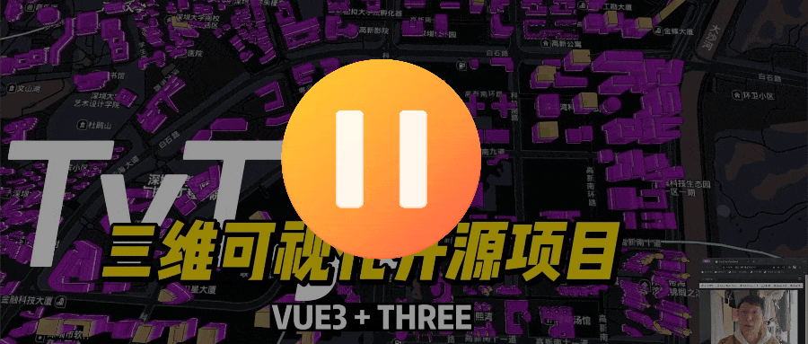
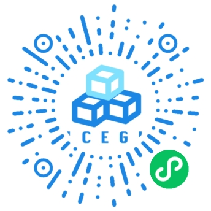
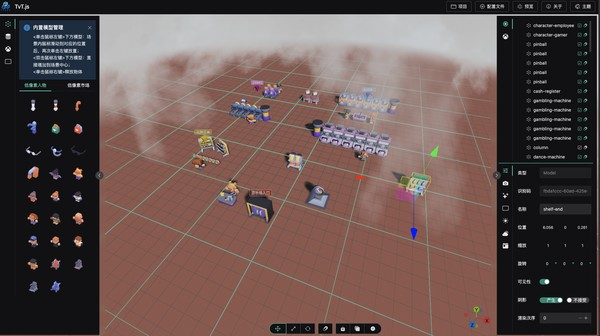
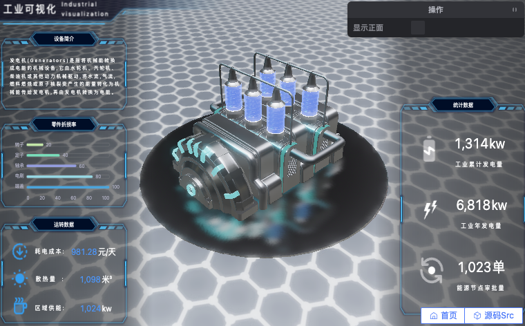
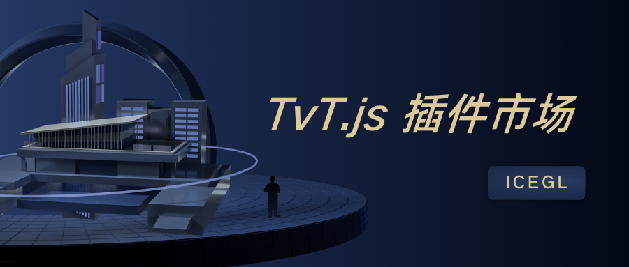
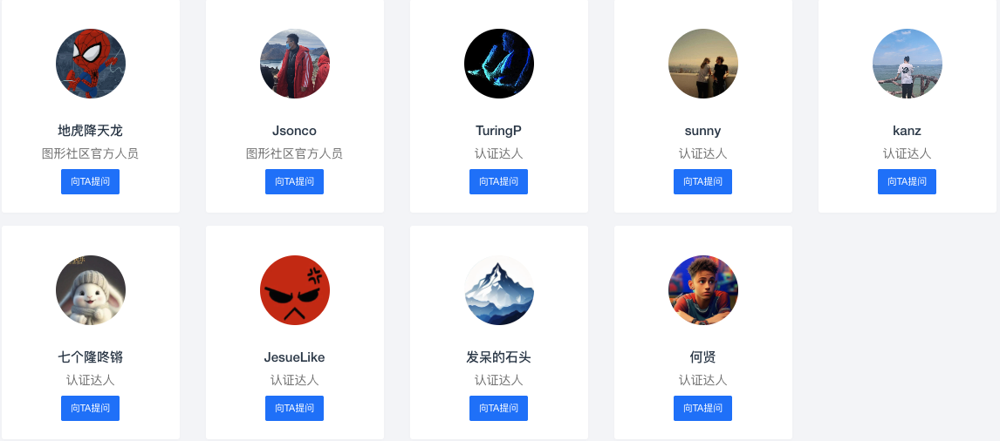
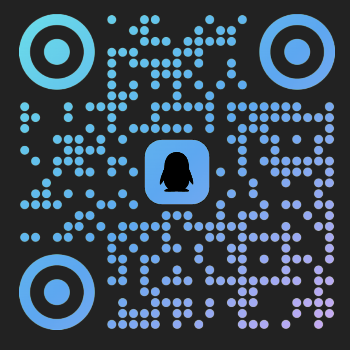

# Three-Vue-Tres 🧳🧳🧳 TvT.js 🧳🧳🧳
A Vue 3 wrapper for Three.js using TresJS for building interactive 3D scenes.

文档说明(语言)：[简体中文](./README_zh.md) | English

## 🎉🎉🎊 An Open-Source Framework for Rapid 3D Visualization Project Development 🎊🎉🎉

<p align="center">
    <a href="https://github.com/hawk86104/three-vue-tres" target="_blank">
      
    </a>
    
    
    <a target="_black" href="https://gitee.com/ice-gl/icegl-three-vue-tres">
      
    </a>
      <a target="_black" href="https://gitcode.com/hawk86104/icegl-three-vue-tres">
      
    </a>
    <a target="_black" href="https://space.bilibili.com/410503457">
       
    </a>
    <a target="_black" href="https://space.bilibili.com/384558900">
       
    </a>
</p>

```shell
If you find this project helpful, please click the "Star⭐" button on the top right corner. Your star is my motivation to keep developing. Thank you!
```

> For video explanation of this project on Bilibili, click the link below 👇🏻

<a style="display:block;width:800px;max-width:100%;" href="https://www.bilibili.com/video/BV1mfCcYeE9E"></a>

# Ecosystem `@ThreeJS @Vue3.x @TresJS`

> Produced by icegl. Permanently open-source and free for commercial use. Ongoing updates. Please click "star⭐" on the top right corner to follow.

This project integrates with three major ecosystems:

- 🎠 ThreeJS \* [Details](https://threejs.org) A renowned browser-based 3D JavaScript library.

- 🍀 Vue3.x \* [Details](https://vuejs.org) Easy to learn and use, excellent performance, rich use cases as a web frontend framework.

- ⚡ TresJS \* [Details](https://tresjs.org) Declarative ThreeJS with Vue3 components for frontend 3D projects.

## 🏥 Preview: [🌏 opensource.icegl.cn](https://opensource.icegl.cn)

- If access is slow, use mirror: [🌏 oss.icegl.cn](http://oss.icegl.cn/)
- If VPN is available, use GitHub Pages mirror: [🌏 https://hawk86104.github.io](https://hawk86104.github.io/)
- Scan QR code for mini program: 

> 相关技术栈拓扑图 【包含全套项目源码】: 
<a href="./src/plugins/zoneFreeScene/pages/freeTvtStack.vue">git项目源码地址</a>

在线编辑器再次编辑后免费导出源码项目二开 :
<a href="https://oss.icegl.cn/p/zone3Deditor/#/plugins/zone3Deditor/index?sceneConfig=freeTvtStack">zone3Deditor页面跳转</a>

<a style="display:block;width:800px;max-width:100%;" href="https://opensource.icegl.cn/#/plugins/zoneFreeScene/freeTvtStack"></a>

<table style="border: none; width: 100%; text-align: center;">
  <tr>
    <td style="padding:10px;font-size:1.2em;">
      <a href="https://oss.icegl.cn/p/zone3Deditor/#/plugins/zone3Deditor/index">
        在线三维场景编辑器：[🪅免费导出源码+二次开发 ]
      </a>
    </td>
    <td style="padding:10px;font-size:1.2em;">
      <a href="https://www.icegl.cn/tvtstore/zoneMachinRoom">
        智慧机房：[ 编辑器直接落地项目 ]
      </a>
    </td>
  </tr>
  <tr>
    <td style="padding: 10px;">
      <a href="https://oss.icegl.cn/p/zone3Deditor/#/plugins/zone3Deditor/index" style="display:block;max-width:100%;">
        
      </a>
    </td>
    <td style="padding: 10px;">
      <a href="https://www.icegl.cn/tvtstore/zoneMachinRoom" style="display:block;max-width:100%;">
        
      </a>
    </td>
  </tr>
  <tr>
    <td style="padding:10px;font-size:1.2em;">
			<a href="https://www.icegl.cn/tvtstore/zoneRefiningIndustry">
				炼化智能工厂可视化：[ 编辑器直接落地项目 ]
			</a>
		</td>
			  <td style="padding:10px;font-size:1.2em;">
			<a href="https://www.icegl.cn/tvtstore/zoneOfficeFloor">
				智能办公空间：[ 编辑器直接落地项目 ]
			</a>
		</td>

  </tr>
	<tr>
    <td style="padding: 10px;">
			<a href="https://oss.icegl.cn/p/zoneRefiningIndustry/#/plugins/zoneRefiningIndustry/index" style="display:block;max-width:100%;">
				
			</a>
		</td>
				<td style="padding: 10px;">
			<a href="https://oss.icegl.cn/p/zoneOfficeFloor/#/plugins/zoneOfficeFloor/index" style="display:block;max-width:100%;">
				
			</a>
		</td>
  </tr>
		<tr>
    <td style="padding:10px;font-size:1.2em;">
			<a href="https://www.icegl.cn/tvtstore/zoneLowAltitudeUAV.html">
				无人机组可视化：[ 编辑器直接落地项目 ]
			</a>
		</td>
		<td style="padding:10px;font-size:1.2em;">
			<a href="https://opensource.icegl.cn/#/#zoneFreeScene">
				低像素炼油厂：[ 免费 ]
			</a>
		</td>
  </tr>
	<tr>
    <td style="padding: 10px;">
			<a href="https://www.icegl.cn/tvtstore/zoneLowAltitudeUAV.html" style="display:block;max-width:100%;">
								
			</a>
		</td>
		<td style="padding: 10px;">
			<a href="https://oss.icegl.cn/p/zone3Deditor/#/plugins/zone3Deditor/index?sceneConfig=freeRefiningIndustry" style="display:block;max-width:100%;">
				
			</a>
		</td>
  </tr>
</table>


```shell
If access errors occur due to frequent project updates and builds, please clear browser cache.
```

<a href="https://opensource.icegl.cn"></a>
<a href="https://opensource.icegl.cn"></a>
<a href="https://opensource.icegl.cn"></a>
<a href="https://opensource.icegl.cn"></a>


More demos are available on the preview page.

# Advantages

- 🌈 Frontend Fundamentals \* FesJS [Details](https://fesjs.mumblefe.cn) Integrated libraries for icons, i18n, API calls, state management (Vuex/Pinia), layout/access/route management.

- 🌠 Write 3D visualization projects just like writing Vue3.x [Details](https://tresjs.org/guide) Fully supports latest ThreeJS. Use modern Vue3 syntax and TS/JS interchangeably.

```html
<template>
  <TresCanvas window-size>
    <TresPerspectiveCamera />
    <TresMesh>
      <TresTorusGeometry :args="[1, 0.5, 16, 32]" />
      <TresMeshBasicMaterial color="orange" />
    </TresMesh>
  </TresCanvas>
</template>
<script setup lang="ts">
  import { useLoop } from '@tresjs/core'
	import { useTextures } from 'PLS/basic'
	const pTexture = await useTextures(['./**.jpg', './**.png'])
	const { onLoop } = useLoop()
	onBeforeRender(({ delta }) => {
			// render loop
	})
</script>
```

### Please support with: Follow 💛 Like ⭐ Fork👣

# ✅ Quick Start

```js
1. git clone or download this repo
2. cd to project root
3. yarn // install dependencies [node -v >= 20.18]
4. yarn pre.dev // preview debug mode
5. yarn dev // project debug mode
6. yarn pre.build // build preview
7. yarn build // build project
8. yarn pre.dev.one // preview a specific example/plugin
9. yarn pre.build.one // build a specific example/plugin
10. yarn both // start dev and pre.dev together
```

# 📖 Documentation

## User Guide: [🌏docs.icegl.cn](https://docs.icegl.cn/)
<table style="border: none; width: 100%; text-align: center;">
  <tr>
    <td style="padding:10px;font-size:1.2em;">
      <a href="https://docs.icegl.cn/docs/three-vue-tres/editor/threeeditor.html">
        3D Editor: [ 📊Native Editor + Plugin Generator ]
      </a>
    </td>
    <td style="padding:10px;font-size:1.2em;">
      <a href="https://docs.icegl.cn/docs/three-vue-tres/editor/goview.html">
        UI Editor: [ 📊GoView Export + Config Import Component ]
      </a>
    </td>
  </tr>
  <tr>
    <td style="padding: 10px;">
      <a href="https://docs.icegl.cn/docs/three-vue-tres/editor/threeeditor.html" style="display:block;max-width:100%;">
        
      </a>
    </td>
    <td style="padding: 10px;">
      <a href="https://docs.icegl.cn/docs/three-vue-tres/editor/goview.html" style="display:block;max-width:100%;">
        
      </a>
    </td>
  </tr>
  <tr>
    <td style="padding:10px;font-size:1.2em;">
      <a href="https://docs.icegl.cn/docs/three-vue-tres/frontend/uniapp.html">
        uniapp Mini Program Ecosystem: [ One Code, Full Platform Solution ]
      </a>
    </td>
    <td style="padding:10px;font-size:1.2em;">
      <a href="https://docs.icegl.cn/docs/three-vue-tres/qiankun/introduction.html">
        Qiankun Micro Frontend: [ Seamless Integration into Existing Projects ]
      </a>
    </td>
  </tr>
  <tr>
    <td style="padding: 10px;">
      <a href="https://docs.icegl.cn/docs/three-vue-tres/frontend/uniapp.html" style="display:block;max-width:100%;">
        
      </a>
    </td>
    <td style="padding: 10px;">
      <a href="https://docs.icegl.cn/docs/three-vue-tres/qiankun/introduction.html" style="display:block;max-width:100%;">
        
      </a>
    </td>
  </tr>
</table>

# 🧩 Rich [Plugin Marketplace 🌏tvtstore](https://www.icegl.cn/tvtstore)
#### [🌏www.icegl.cn/tvtstore](https://www.icegl.cn/tvtstore) contains a variety of project scenarios and features. Plugins are a vital part of the ICE community ecosystem. In the marketplace, both complete applications and functional modules are referred to as plugins.<br/>
<table style="border: none; width: 100%; text-align: center;">
  <tr>
    <td style="padding:10px;font-size:1.2em;">
      <a href="https://www.icegl.cn/tvtstore">
        Plugin Marketplace
      </a>
    </td>
    <td style="padding:10px;font-size:1.2em;">
      <a href="https://www.icegl.cn/p/tvtdeveloper">
        Become an Author & Join Us
      </a>
    </td>
  </tr>
  <tr>
    <td style="padding: 10px;">
      <a href="https://www.icegl.cn/tvtstore" style="display:block;max-width:100%;">
        
      </a>
    </td>
    <td style="padding: 10px;">
      <a href="https://www.icegl.cn/p/tvtdeveloper" style="display:block;max-width:100%;">
        
      </a>
    </td>
  </tr>
</table>

# ❓ Feedback & Support

If you have any questions while using the platform, feel free to reach out through the following methods:

### Q&A Community: [ICE Graphics Community icegl.cn](https://www.icegl.cn/ask)

<a href="https://www.icegl.cn/ask" style="display:block;width:800px;max-width:100%;">
</a>

#### Community Contributors & Experts: [Ask the Experts](https://icegl.cn/ask/experts)
<a href="https://icegl.cn/ask/experts.html" style="display:block;width:800px;max-width:100%;">
</a>

### Feel free to join our WeChat and QQ groups. Some groups are already full, but we're always happy to connect and learn WebGL together! Add us on WeChat to join the groups.

<table style="border: none; width: 60%; text-align: center;">
  <tr>
    <td style="padding:10px;font-size:1.2em;">
        WeChat Mini Program Ecosystem
    </td>
    <td style="padding:10px;font-size:1.2em;">
        WeChat Group
    </td>
    <td style="padding:10px;font-size:1.2em;">
      <a href="https://qm.qq.com/q/34V4hTtvbq">
        QQ Group: 795714357
      </a>
    </td>
    <td style="padding:10px;font-size:1.2em;">
        Official Account: ICE Graphics Community
    </td>
  </tr>
  <tr>
    <td style="padding: 10px;">
      <p style="display:block;max-width:100%;">
        
      </p>
    </td>
    <td style="padding: 10px;">
      <p style="display:block;max-width:100%;">
        
      </p>
    </td>
    <td style="padding: 10px;">
      <a href="https://qm.qq.com/q/34V4hTtvbq" style="display:block;max-width:100%;">
        
      </a>
    </td>
    <td style="padding: 10px;">
      <p style="display:block;max-width:100%;">
        
      </p>
    </td>
  </tr>
</table>

# ⭐ Star History

[](https://star-history.com/#hawk86104/three-vue-tres&hawk86104/vue3-ts-cesium-map-show&Date)

# ™️ Copyright Information

This project is released under the Apache 2.0 open-source license, providing free lifetime use and allowing commercial applications.

> If you use this project for commercial purposes, please comply with the Apache 2.0 license and retain the author’s technical support acknowledgment.

-   For secondary development intended for commercial use or open-source competitors, please do not remove or modify the copyright, author statement, or source attribution at the top of the TvT.js source code.
-   Commercial use is allowed, but secondary open-sourcing and charging for it are prohibited.

The copyright information of third-party source code and binary files included in this project will be noted separately.

Follow our official WeChat account to receive the latest updates.
<p align = "left">    

</p>

Copyright © 2022-2026 by 🧊icegl (https://www.icegl.cn)

All rights reserved。


