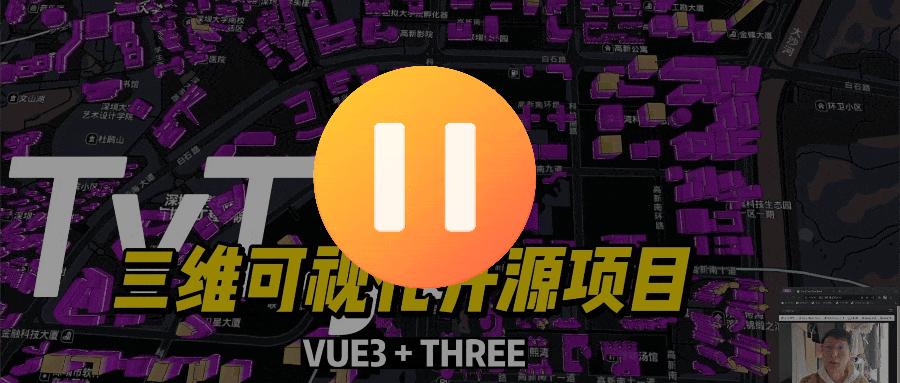
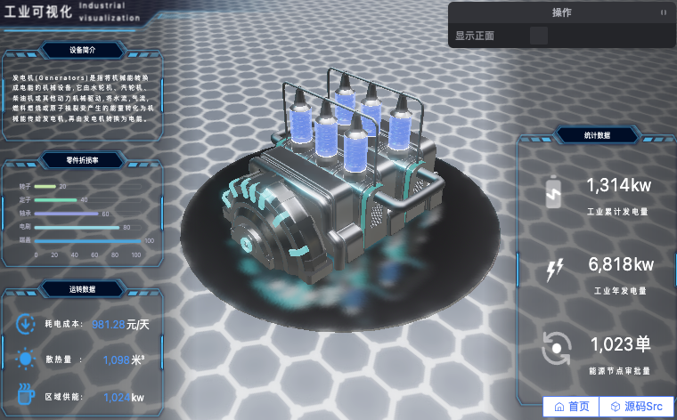
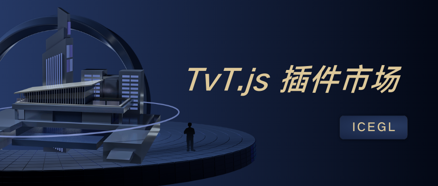
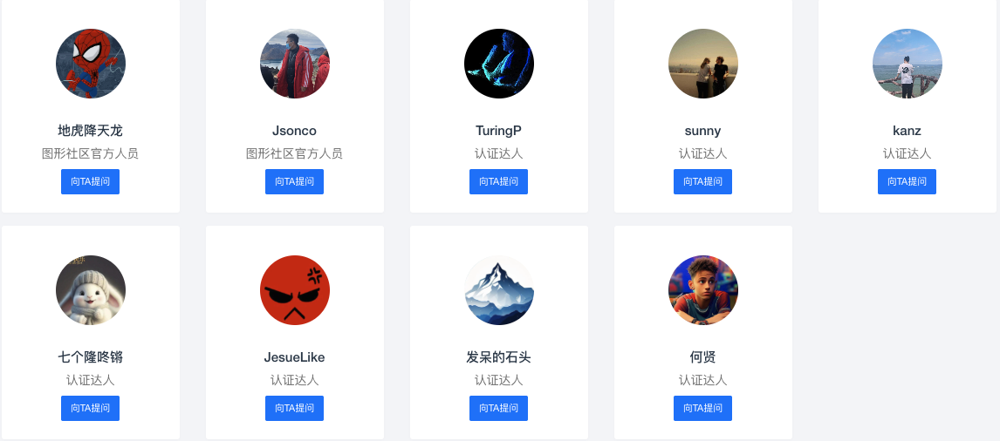

# 🧊🧊🧊 TvT.js 🧊🧊🧊
简体中文 | [English](./README.md)
## 🎉🎉🎊 三维可视化项目快速落地的开源框架 🎊🎉🎉

<p align="center">
		<a href="https://github.com/hawk86104/three-vue-tres" target="_blank">
			
		</a>
		
		
		<a target="_black" href="https://gitee.com/ice-gl/icegl-three-vue-tres">
			
		</a>
			<a target="_black" href="https://gitcode.com/hawk86104/icegl-three-vue-tres">
			
		</a>
		<a target="_black" href="https://space.bilibili.com/410503457">
			 
		</a>
		<a target="_black" href="https://space.bilibili.com/384558900">
			 
		</a>
</p>

## 🧊🧊🧊🧊🧊🧊🧊🧊🧊🧊🧊🧊🧊🧊🧊🧊🧊🧊🧊🧊

## 此为最新V5版本`tvt.js`
> 从2025年十月中旬已经全面升级所有依赖库，涉及Vue3、Tres V5、Fes V4、Cientos V4 以及 Three.js (r17x → r18x) 等的版本更新

> 全面拥抱`ES Module`，无缝对接`webGPU` 等等

> 若您是从之前`tvt.js`的V4版本升级，我们有详细的升级方法，请跳转：[icegl.cn/ask/article/22769](https://icegl.cn/ask/article/22769.html)

> 旧版V4:[所属分支：tres-v4_fes-v3 ](https://gitee.com/ice-gl/icegl-three-vue-tres/tree/tres-v4_fes-v3/)

```shell
如果对您有帮助，您可以点右上角 “Star⭐” 收藏一下 ，您的star就是我开发的动力，感谢！
```

> B 站上对此项目的视频说明点击下方 👇🏻 跳转

<a style="display:block;width:800px;max-width:100%;" href="https://www.bilibili.com/video/BV1mfCcYeE9E"></a>

# 生态 `@ThreeJS @Vue3.x @TresJS`

> icegl 出品，永久开源且免费商用，持续更新 ing，请点击右上角 start⭐ 关注

本项目融合于三大生态系统中：

-   🎲 ThreeJS \* [点击详情](https://threejs.org)
		<a href="https://www.npmjs.com/package/three">
		
		</a>
		ThreeJS 大名鼎鼎的基于浏览器渲染，JavaScript 语言的 3D 库。<br/><br/>

-   🍀 Vue3.x \* [点击详情](https://cn.vuejs.org)
		<a href="https://www.npmjs.com/package/vue">
		
		</a>
		易学易用，性能出色，适用场景丰富的 Web 前端框架。<br/><br/>

-   ⚡ TresJS \* [点击详情](https://tresjs.org)
		<a href="https://www.npmjs.com/package/@tresjs/core">
		
		</a>
		使用 Vue3.x 组件实现声明式的 ThreeJS，做属于前端的三维项目。<br/><br/>

## 🏕 点击预览：[🌏 opensource.icegl.cn](https://opensource.icegl.cn)

-   如果访问太慢，请访问镜像站点：[🌏 oss.icegl.cn](http://oss.icegl.cn/)
-   如果有条件，也可直接访问 github 的镜像站:[🌏 https://hawk86104.github.io](https://hawk86104.github.io/)
-   全案例微信小程序生态：[🌏 微信内打开](#小程序://三维开源/456pgpJZBiTctdK)
-   全案例微信小程序扫码：

> 相关技术栈拓扑图 【包含全套项目源码】: 
<a href="./src/plugins/zoneFreeScene/pages/freeTvtStack.vue">git项目源码地址</a>

在线编辑器再次编辑后免费导出源码项目二开 :
<a href="https://oss.icegl.cn/p/zone3Deditor/#/plugins/zone3Deditor/index?sceneConfig=freeTvtStack">zone3Deditor页面跳转</a>

<a style="display:block;width:800px;max-width:100%;" href="https://opensource.icegl.cn/#/plugins/zoneFreeScene/freeTvtStack"></a>

<table style="border: none; width: 100%; text-align: center;">
  <tr>
    <td style="padding:10px;font-size:1.2em;">
			<a href="https://oss.icegl.cn/p/zone3Deditor/#/plugins/zone3Deditor/index">
				在线三维场景编辑器：[🪅免费导出源码+二次开发 ]
			</a>
		</td>
    <td style="padding:10px;font-size:1.2em;">
			<a href="https://www.icegl.cn/tvtstore/zoneMachinRoom">
				智慧机房：[ 编辑器直接落地项目 ]
			</a>
		</td>
  </tr>
	<tr>
    <td style="padding: 10px;">
			<a href="https://oss.icegl.cn/p/zone3Deditor/#/plugins/zone3Deditor/index" style="display:block;max-width:100%;">
				
			</a>
		</td>
    <td style="padding: 10px;">
			<a href="https://www.icegl.cn/tvtstore/zoneMachinRoom" style="display:block;max-width:100%;">
				
			</a>
		</td>
  </tr>
	<tr>
    <td style="padding:10px;font-size:1.2em;">
			<a href="https://www.icegl.cn/tvtstore/zoneRefiningIndustry">
				炼化智能工厂可视化：[ 编辑器直接落地项目 ]
			</a>
		</td>
			  <td style="padding:10px;font-size:1.2em;">
			<a href="https://www.icegl.cn/tvtstore/zoneOfficeFloor">
				智能办公空间：[ 编辑器直接落地项目 ]
			</a>
		</td>

  </tr>
	<tr>
    <td style="padding: 10px;">
			<a href="https://oss.icegl.cn/p/zoneRefiningIndustry/#/plugins/zoneRefiningIndustry/index" style="display:block;max-width:100%;">
				
			</a>
		</td>
				<td style="padding: 10px;">
			<a href="https://oss.icegl.cn/p/zoneOfficeFloor/#/plugins/zoneOfficeFloor/index" style="display:block;max-width:100%;">
				
			</a>
		</td>
  </tr>
		<tr>
    <td style="padding:10px;font-size:1.2em;">
			<a href="https://www.icegl.cn/tvtstore/zoneLowAltitudeUAV.html">
				无人机组可视化：[ 编辑器直接落地项目 ]
			</a>
		</td>
		<td style="padding:10px;font-size:1.2em;">
			<a href="https://opensource.icegl.cn/#/#zoneFreeScene">
				低像素炼油厂：[ 免费 ]
			</a>
		</td>
  </tr>
	<tr>
    <td style="padding: 10px;">
			<a href="https://www.icegl.cn/tvtstore/zoneLowAltitudeUAV.html" style="display:block;max-width:100%;">
				
			</a>
		</td>
		<td style="padding: 10px;">
			<a href="https://oss.icegl.cn/p/zone3Deditor/#/plugins/zone3Deditor/index?sceneConfig=freeRefiningIndustry" style="display:block;max-width:100%;">
				
			</a>
		</td>
  </tr>
</table>

```shell
因项目经常更新编译，如发现访问错误，请清空浏览器缓存。
```

<a href="https://opensource.icegl.cn"></a>
<a href="https://opensource.icegl.cn"></a>
<a href="https://opensource.icegl.cn"></a>
<a href="https://opensource.icegl.cn"></a>

更多演示请进入预览页面

# 优势

-   🌈 前端の基本素养 \* FesJS [点击详情](https://fesjs.mumblefe.cn)<br/>
<a href="https://www.npmjs.com/package/@fesjs/fes">

</a><br/>
集成封装项目落地的常用库：图标、多语言、API 接口调用、Vuex/Pinia、model 数据封装、页面 layout/权限 access、路由管理等。<br/>

-   🌠 像写 Vue3.x 一样写三维可视化项目[点击详情](https://tresjs.org/guide)<br/>
<br/>
全功能版本追溯保持 threeJS 最新版本 \* TresJS
最新 Vue3.x 的语法糖写法，TS/JS 通吃，让你以最新最爽快的方式构建三维可视化项目

```html
<template>
		<TresCanvas window-size>
				<TresPerspectiveCamera />
				<TresMesh>
						<TresTorusGeometry :args="[1, 0.5, 16, 32]" />
						<TresMeshBasicMaterial color="orange" />
				</TresMesh>
		</TresCanvas>
</template>
<script setup lang="ts">
		import { useLoop } from '@tresjs/core'
		import { useTextures } from 'PLS/basic'
		//读取材质
		const pTexture = await useTextures(['./**.jpg', './**.png'])
		const { onLoop } = useLoop()
		onBeforeRender(({ delta }) => {
				//循环render
		})
</script>
```

### 敬请右上角一键三连: 关注 💛 点赞 ⭐ fork👣

# ✅ 快速开始

```js
1、git clone 或者 直接下载 本项目

2、cd 到项目根目录

3、yarn	// 安装依赖 [node版本>=20.18]

4、yarn pre.dev	// 预览 下的调试模式

5、yarn dev	// 自己项目 下的调试模式

6、yarn pre.build	// 预览 下的编译打包

7、yarn build	// 自己项目 下的编译打包

8、yarn pre.dev.one	// 只展示某一个案例/插件

9、yarn pre.build.one // 针对某一个案例/插件打包，会根据配置下的依赖插件项保留资源，其余资源删除

10、yarn both  // 同时启动 dev 和 pre.dev 可以边调试自己得项目，边对照移植样例和插件
```


# 📖 文档

## 使用说明：[🌏docs.icegl.cn](https://docs.icegl.cn/)
<table style="border: none; width: 100%; text-align: center;">
  <tr>
    <td style="padding:10px;font-size:1.2em;">
			<a href="https://docs.icegl.cn/docs/three-vue-tres/editor/threeeditor.html">
				三维编辑器：[ 📊原生编辑器＋插件生成器 ]
			</a>
		</td>
    <td style="padding:10px;font-size:1.2em;">
			<a href="https://docs.icegl.cn/docs/three-vue-tres/editor/goview.html">
				UI 编辑器：[ 📊GoView导出＋配置导入组件 ]
			</a>
		</td>
  </tr>
  <tr>
    <td style="padding: 10px;">
			<a href="https://docs.icegl.cn/docs/three-vue-tres/editor/threeeditor.html" style="display:block;max-width:100%;">
				
			</a>
		</td>
    <td style="padding: 10px;">
			<a href="https://docs.icegl.cn/docs/three-vue-tres/editor/goview.html" style="display:block;max-width:100%;">
				
			</a>
		</td>
  </tr>
	  <tr>
    <td style="padding:10px;font-size:1.2em;">
			<a href="https://docs.icegl.cn/docs/three-vue-tres/frontend/uniapp.html">
				uniapp小程序生态：[ 一码全端覆盖-解决方案 ]
			</a>
		</td>
    <td style="padding:10px;font-size:1.2em;">
			<a href="https://docs.icegl.cn/docs/three-vue-tres/qiankun/introduction.html">
				qiankun微前端：[ 快速接入您现有项目中 ]
			</a>
		</td>
  </tr>
  <tr>
    <td style="padding: 10px;">
			<a href="https://docs.icegl.cn/docs/three-vue-tres/frontend/uniapp.html" style="display:block;max-width:100%;">
				
			</a>
		</td>
    <td style="padding: 10px;">
			<a href="https://docs.icegl.cn/docs/three-vue-tres/qiankun/introduction.html" style="display:block;max-width:100%;">
				
			</a>
		</td>
  </tr>
</table>

# 🧩 丰富的[插件应用市场🌏tvtstore](https://www.icegl.cn/tvtstore)
#### [🌏www.icegl.cn/tvtstore](https://www.icegl.cn/tvtstore) 包含各式各样的项目场景和功能。插件是 ICE 社区生态中重要的一环，在应用市场中完整应用和普通插件统一称为插件。<br/>
<table style="border: none; width: 100%; text-align: center;">
  <tr>
    <td style="padding:10px;font-size:1.2em;">
			<a href="https://www.icegl.cn/tvtstore">
				插件应用市场
			</a>
		</td>
    <td style="padding:10px;font-size:1.2em;">
			<a href="https://www.icegl.cn/p/tvtdeveloper">
				成为作者，加入我们
			</a>
		</td>
  </tr>
  <tr>
    <td style="padding: 10px;">
			<a href="https://www.icegl.cn/tvtstore" style="display:block;max-width:100%;">
				
			</a>
		</td>
    <td style="padding: 10px;">
			<a href="https://www.icegl.cn/p/tvtdeveloper" style="display:block;max-width:100%;">
				
			</a>
		</td>
  </tr>
</table>

# ❓ 问题反馈

在使用中有任何问题，请使用以下联系方式联系我们

### 问答社区: [图形学社区 icegl.cn](https://www.icegl.cn/ask)

<a href="https://www.icegl.cn/ask" style="display:block;width:800px;max-width:100%;">
</a>

#### 社区贡献者以及达人: [向他们提问](https://icegl.cn/ask/experts)
<a href="https://icegl.cn/ask/experts.html" style="display:block;width:800px;max-width:100%;">
</a>

### 欢迎大家也加入微信群，QQ群，已有几个群已满，一起学习讨论 webgl。加微信我拉进群
<table style="border: none; width: 60%; text-align: center;">
  <tr>
		<td style="padding:10px;font-size:1.2em;">
				微信小程序生态
		</td>
    <td style="padding:10px;font-size:1.2em;">
				微信群
		</td>
    <td style="padding:10px;font-size:1.2em;">
			<a href="https://qm.qq.com/q/34V4hTtvbq">
				QQ群: 795714357
			</a>
		</td>
		<td style="padding:10px;font-size:1.2em;">
				公众号: ICE图形学社区
		</td>
  </tr>
  <tr>
	  <td style="padding: 10px;">
			<p style="display:block;max-width:100%;">
				
			</p>
		</td>
    <td style="padding: 10px;">
			<p style="display:block;max-width:100%;">
				
			</p>
		</td>
    <td style="padding: 10px;">
			<a href="https://qm.qq.com/q/34V4hTtvbq" style="display:block;max-width:100%;">
				
			</a>
		</td>
		<td style="padding: 10px;">
			<p style="display:block;max-width:100%;">
				
			</p>
		</td>
  </tr>
</table>

# ⭐ 点星历史

[](https://star-history.com/#hawk86104/three-vue-tres&hawk86104/vue3-ts-cesium-map-show&Date)

# ™️ 版权信息

本项目遵循 **Apache License 2.0** 协议开源，永久免费使用，允许商业化。

> 如将本项目用于商业用途，请严格遵守 Apache License 2.0 协议，并保留作者署名及技术支持声明。

1. **二次开发与版权声明**

   * 在基于本项目进行二次开发（包括但不限于功能扩展、界面修改、适配定制）时，为了TvT.js开源项目的健康发展，无论用于商业还是非商业目的，均不得删除、修改或隐藏 TvT.js 源码文件头部的版权、作者声明及项目出处信息。

2. **允许的商业用途与限制**

   * 允许以本项目为基础，结合自身独立开发的核心功能或产品，形成以**自研内容为主体**的商业化项目（包括收费服务、软件产品等）。
   * 不允许直接将本项目的源码或仅作少量改动后进行**重新开源并收费**，或以几乎未改动的形式包装成付费产品进行贩卖。

3. **第三方组件说明**

   * 本项目所包含的第三方源码及二进制文件，其版权信息及许可证另行标注，请遵循相应的开源协议。

版权所有 Copyright © 2022-2026 by 🧊icegl (https://www.icegl.cn)

All rights reserved。
